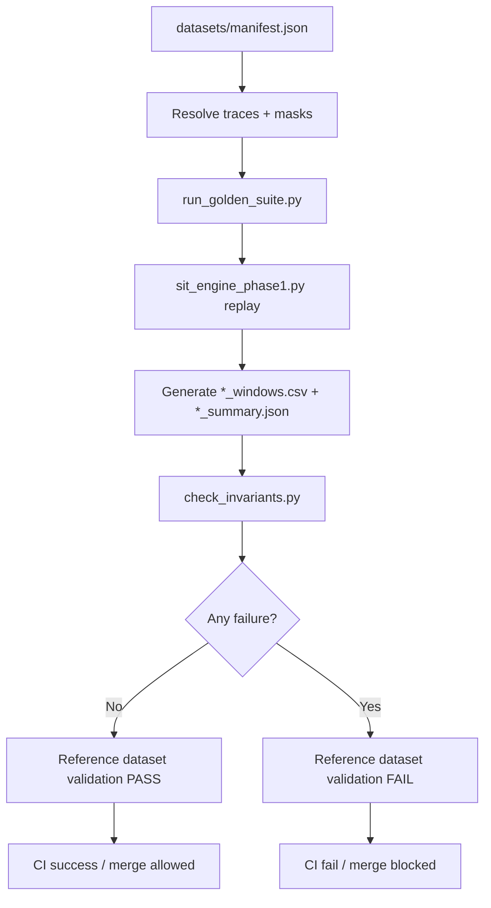

# Reference Datasets — Phase-1

This document defines the Phase-1 reference dataset bundle used for deterministic SIT validation and regression control.

---

## 1. Purpose & Scope

Reference datasets provide pinned, minimal, high-signal inputs for:
- semantic validation of SIT behavior,
- reproducible regression testing across code changes,
- consistent CI replay coverage.

In this repository, the reference bundle includes:
- canonical trace files (`datasets/traces/*.csv`),
- canonical residency masks (`datasets/residency/*.csv`),
- manifest metadata (`datasets/manifest.json`) that drives replay orchestration.

The scope is **correctness and stability**, not workload performance benchmarking.

---

## 2. Dataset Architecture & Components

### 2.1 Physical layout
- `Phase-1/datasets/manifest.json`
- `Phase-1/datasets/traces/`
- `Phase-1/datasets/residency/`

### 2.2 Manifest contract
`manifest.json` currently carries:
- `dataset_version`: dataset bundle version tag,
- `engine`: linkage metadata (`name`, `version`, `schema_version`),
- `window_us_default`: canonical window size for replay,
- `traces[]`: ordered list of test traces,
- `residency_masks{}`: named masks used by mode-specific invariant checks.

### 2.3 Consumption path
Primary consumer:
- `Phase-1/tests/run_golden_suite.py`

The harness loads the manifest and executes all trace/mask combinations against:
- `Phase-1/sit_engine_phase1.py`
- `Phase-1/tests/check_invariants.py`

---

## 3. Dataset Semantics and Coverage Model

The bundle is intentionally small but behaviorally diverse:
- single residency region behavior,
- multi-window gaps,
- injected stall gradients,
- memory-pressure patterns,
- multi-core synchronization behavior.

Residency masks cover distinct boundary semantics:
- `all`: always-resident coverage,
- `skip_w0`: first-window exclusion behavior,
- `partial`: partial overlaps across multiple windows,
- `exact_boundary`: exact cutover at window boundary.

This gives orthogonal coverage for:
- SIT bounds,
- conservation invariants,
- boundary arithmetic,
- residency gating semantics.

---

## 4. Implementation Detail

### 4.1 Module/file responsibilities
- `Phase-1/datasets/manifest.json`
  - authoritative test input registry and replay parameters.
- `Phase-1/tests/run_golden_suite.py`
  - manifest loader, replay loop, failure aggregator.
- `Phase-1/tests/check_invariants.py`
  - semantic correctness predicates.
- `.github/workflows/phase1-ci.yml`
  - CI executor of dataset-driven validation.

### 4.2 How dataset replay is triggered
`run_golden_suite.py`:
1. loads manifest,
2. iterates each trace in `traces[]`,
3. runs base mode and all configured mask modes,
4. runs invariants per generated windows artifact,
5. exits non-zero on any failure.

### 4.3 Failure surfacing
- Missing trace/mask files are surfaced by explicit `SKIP` logs.
- Engine/invariant failures are collected and printed under a consolidated `FAILURES:` block.
- Exit status `2` propagates to CI failure state.

---

## 5. Versioning, Governance, and Linkage

### 5.1 Version anchors
- Dataset bundle version is explicit (`dataset_version`).
- Engine linkage is explicit (`engine.name`, `engine.version`, `engine.schema_version`).

This ties dataset expectations to a specific engine/schema contract, reducing ambiguity during regression triage.

### 5.2 Update policy (recommended operational model)
When modifying reference datasets:
1. update `dataset_version`,
2. update `engine` linkage if engine/schema expectation changes,
3. run full golden suite locally,
4. require CI pass before merge.

### 5.3 Current governance maturity
Strengths:
- Manifest-driven deterministic replay,
- named masks and bounded trace set,
- CI-connected execution path.

Gaps to consider:
- optional checksums/signatures for trace immutability,
- optional changelog entry per dataset version bump.

---

## 6. Integration with Validation and SIT Metrics

Reference datasets are not passive fixtures; they are the executable backbone of Validation Suite behavior:
- Validation suite depends on manifest-defined traces/masks.
- CI depends on validation suite exit code.
- SIT metrics reported by regression runs are reproducible because dataset inputs are pinned.

Operational commands:
```bash
cd Phase-1
python3 tests/run_golden_suite.py --outdir golden_out
```

For Python 3.9+ environment consistency:
```bash
python3.9 tests/run_golden_suite.py --outdir /tmp/phase1_golden_py39
```

---

## 7. Flowchart



---

## 8. Done-When Criteria Mapping

Deliverable target: **“Versioned dataset bundle linked to engine version.”**

| Done-When Requirement | Repository Evidence | Status |
|---|---|---|
| Versioned dataset bundle exists | `Phase-1/datasets/manifest.json` includes `dataset_version` | Met |
| Bundle is consumable by automated regression | `Phase-1/tests/run_golden_suite.py` loads manifest and replays all entries | Met |
| Bundle drives semantic checks | `Phase-1/tests/check_invariants.py` is invoked per replayed output | Met |
| Bundle is CI-enforced | `.github/workflows/phase1-ci.yml` runs golden suite on push/PR | Met |
| Dataset linked to engine version | `manifest.json` includes `engine.name/version/schema_version` | Met |

