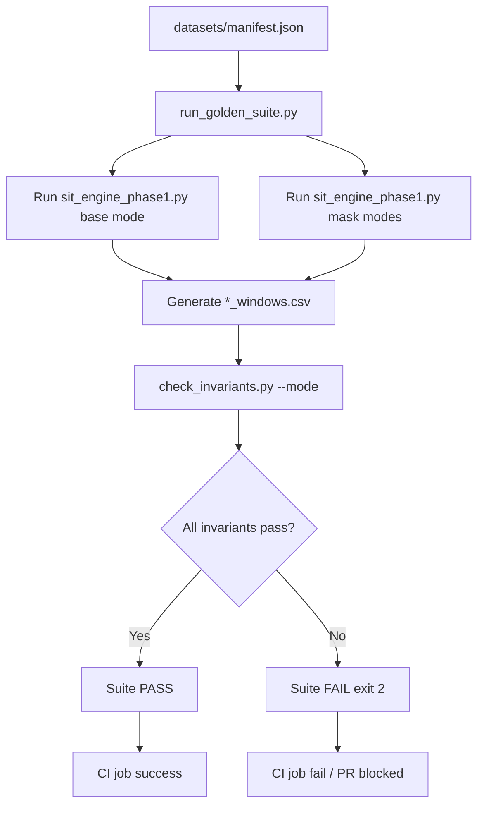
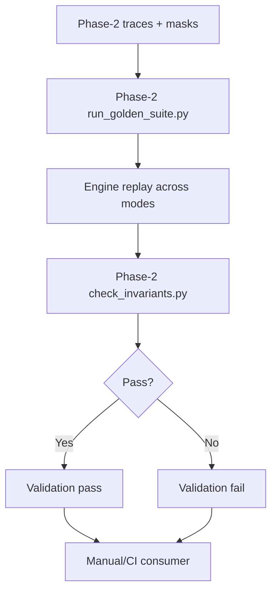

# Validation — Phase-1 (With Phase-2 Invariant Alignment)

This document describes validation architecture and execution behavior for:
- Phase-1 Validation Suite
- Phase-2 Invariant Validation Suite (alignment and current CI state)

It is implementation-grounded to the current repository state.

---

## Phase-1: Validation Suite

### 1. Purpose & Scope

#### What semantic correctness means here
Semantic correctness means SIT output preserves engine-level behavioral invariants, not just syntactic schema validity. In practice:
- `sit` values stay physically meaningful (`0 <= sit <= 1` on resident windows).
- Resident-window state fractions (`active_frac`, `stall_frac`, `idle_frac`) conserve total time (`sum == 1` within tolerance).
- Non-resident windows do not carry synthetic activity (`NaN` semantics enforced for fractions and `sit`).
- Residency edge cases (`skip_w0`, `partial`, `exact_boundary`) preserve boundary math expected by the fixed-window model.

#### Regressions it is designed to catch
- Window overlap regressions from changes in interval slicing logic.
- Residency gating regressions where accumulation leaks outside residency masks.
- State accounting regressions where fractions no longer normalize.
- Schema/column drift that breaks invariant evaluators or downstream tools.

#### Relationship to SIT Engine Core and Output Schema v1
- SIT engine produces the candidate artifacts: `*_windows.csv`, `*_summary.json` via `sit_engine_phase1.py`.
- Validation suite asserts semantic correctness over those artifacts.
- Export stage validates and materializes schema v1 (`windows_v1.csv`, `summary_v1.json`, optional parquet) via `schema/v1.py` and `cli.py export`.

Primary paths:
- `Phase-1/sit_engine_phase1.py`
- `Phase-1/tests/run_golden_suite.py`
- `Phase-1/tests/check_invariants.py`
- `Phase-1/schema/v1.py`
- `Phase-1/cli.py`

---

### 2. Architecture & Components

#### Validation suite structure
- **Orchestrator:** `Phase-1/tests/run_golden_suite.py`
  - Reads dataset manifest.
  - Runs engine for each trace in base mode and residency-mask modes.
  - Invokes invariant checks per generated windows file.
  - Aggregates failures and exits non-zero on any failure.
- **Invariant module:** `Phase-1/tests/check_invariants.py`
  - Implements invariant predicates.
  - Dispatches mode-specific checks from CLI arguments.
  - Raises `AssertionError` on semantic violations.
- **Optional trace-level validator:** `Phase-1/tools/validation/validate.py`
  - Supplemental operator-focused checks over adapter artifacts and exports.
  - Not the CI gate; useful for forensic debugging of run directories.

#### Golden traces load/execute/compare model
`run_golden_suite.py` performs deterministic replay over manifest entries:
1. Read `datasets/manifest.json`.
2. Resolve `traces[]`, `residency_masks{}` and `window_us_default`.
3. For each trace:
  - run base engine pass (no residency file),
  - run masked passes for configured modes (`all`, `skip_w0`, `partial`, `exact_boundary`).
4. For each pass, invoke `check_invariants.py` against generated windows output.
5. Collect failures by `(trace, stage)` and fail suite if any stage fails.

Note: this is an invariant-first golden harness. It does not currently do strict numeric diff against pre-stored golden files.

#### Invariant definitions (code-level)
In `check_invariants.py`:
- Common invariants:
  - `check_sit_bounds`
  - `check_fracs_sum_to_one`
  - `check_nonresident_are_nan`
- Mode-specific invariants:
  - `check_skip_w0`
  - `check_partial_expected_resident_us`
  - `check_exact_boundary`
- CLI dispatch in `main()` selects checks based on `--mode`.

---

### 3. Implementation Detail

#### File/module layout
- `Phase-1/tests/run_golden_suite.py`: replay harness and fail aggregation.
- `Phase-1/tests/check_invariants.py`: invariant library + CLI runner.
- `Phase-1/datasets/manifest.json`: authoritative test inputs and masks.
- `Phase-1/sit_engine_phase1.py`: source of computed windows/summary outputs.
- `Phase-1/schema/v1.py`: schema validators used in export stage.
- `Phase-1/cli.py`: ingest/classify/export and schema-validated export.

#### How invariants are registered and triggered
- Registration model is explicit function dispatch, not plugin-based.
- `run_golden_suite.py` hardcodes mode mapping:
  - `("all", "all")`
  - `("skip_w0", "skip_w0")`
  - `("partial", "partial")`
  - `("exact_boundary", "exact_boundary")`
- For each mode, runner executes:
  - engine command
  - invariant command `tests/check_invariants.py --mode <mode>`

#### Failure signaling and reporting
- `check_invariants.py`:
  - throws `AssertionError`,
  - catches and prints `FAIL: <message>`,
  - exits `2`.
- `run_golden_suite.py`:
  - records all failed `(trace, stage, output)` tuples,
  - prints consolidated `FAILURES:` block,
  - exits `2` if any failure exists.
- This non-zero exit is CI-gate-compatible.

---

### 4. CI Integration

#### Hook location and behavior
CI hook is implemented in:
- `.github/workflows/phase1-ci.yml`

#### Trigger conditions
- `push` on all branches
- `pull_request`
- Nightly/scheduled trigger is **not** currently configured.

#### How semantic drift fails PRs
Workflow step runs:
- `python tests/run_golden_suite.py --outdir /tmp/golden_out_ci`

If engine behavior drift violates any invariant:
- invariant script returns non-zero,
- golden suite returns non-zero,
- workflow job fails,
- PR is blocked until fixed.

---

### 5. Flowchart

---

### 6. Done-When Criteria Mapping

Done-when target: **“CI detects semantic regressions.”**

| Check / Mechanism | Code Path | Regression Class Caught | Contribution to Done-When |
|---|---|---|---|
| SIT bounds (`0..1`) | `tests/check_invariants.py::check_sit_bounds` | invalid normalization, overflow/underflow SIT | Blocks CI on impossible SIT values |
| Fraction conservation (`active+stall+idle==1`) | `tests/check_invariants.py::check_fracs_sum_to_one` | overlap/gap accounting bugs | Detects state conservation drift |
| Non-resident NaN discipline | `tests/check_invariants.py::check_nonresident_are_nan` | residency leakage into non-resident windows | Detects semantic leakage outside residency |
| `skip_w0` semantics | `tests/check_invariants.py::check_skip_w0` | boundary/window-index regressions | Protects start-window masking behavior |
| `partial` resident-us exactness | `tests/check_invariants.py::check_partial_expected_resident_us` | partial overlap math regressions | Verifies overlap arithmetic correctness |
| `exact_boundary` semantics | `tests/check_invariants.py::check_exact_boundary` | exact-boundary double-count/assignment regressions | Verifies boundary correctness |
| Cross-trace/mask harness | `tests/run_golden_suite.py` | per-trace regressions hidden in single-case tests | Makes regression detection dataset-wide |
| CI wiring | `.github/workflows/phase1-ci.yml` | undetected script failures in PR flow | Enforces regression detection before merge |

---

## Phase-2: Invariant Validation Suite (Alignment)

### 1. Purpose & Scope
Phase-2 reuses the same invariant model to ensure adapter expansion (Spike/gem5) does not change SIT semantics.

### 2. Architecture & Components
- `Phase-2/tests/check_invariants.py`
- `Phase-2/tests/run_golden_suite.py`
- `Phase-2/datasets/manifest.json`
- `Phase-2/sit_engine_phase1.py`

Component pattern is intentionally isomorphic to Phase-1 for easier parity debugging.

### 3. Implementation Detail
Implementation mirrors Phase-1:
- same invariant primitives and mode dispatch,
- same replay harness behavior (trace loop + mask loop + failure aggregation),
- same process-level failure signaling (`exit 2` on failures).

### 4. CI Integration
Current repository state:
- No dedicated Phase-2 workflow file under `.github/workflows` at repository root.
- Therefore Phase-2 invariant regressions are detectable by scripts but not yet enforced as PR gate by workflow automation.

### 5. Flowchart

### 6. Done-When Criteria Mapping
- Script-level condition is satisfied: invariant regressions are programmatically detected.
- CI-gate condition remains partial until a Phase-2 workflow enforces these scripts on PR events.

