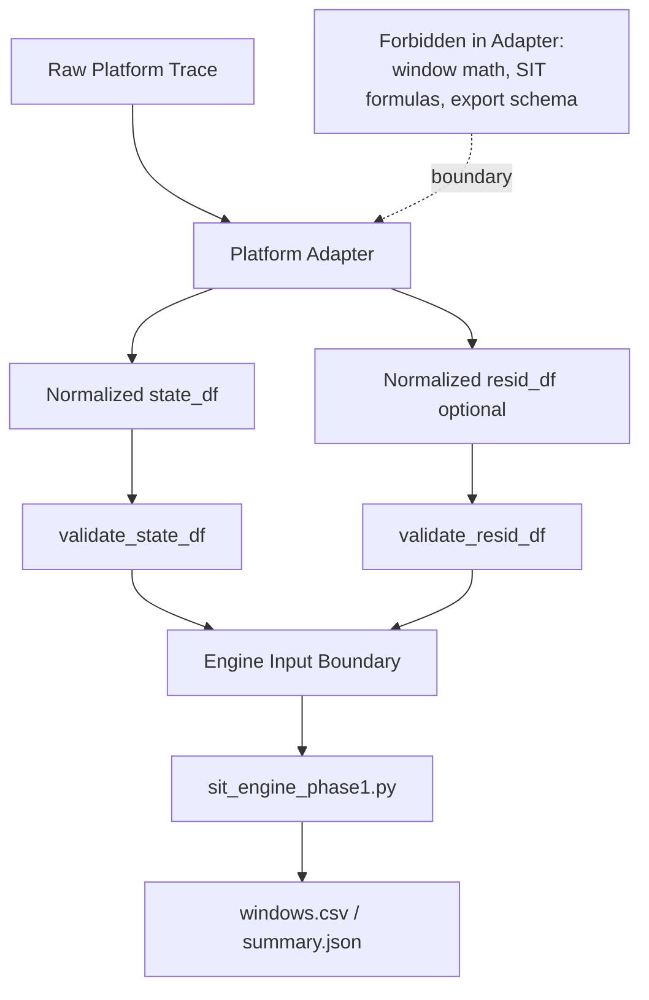

# Phase-2 Adapter Contract

## Deliverable: Adapter Contract (Responsibilities and Boundaries)

### Technical Description
The adapter contract defines the only allowed interface between source-specific traces and the SIT engine. It prevents semantic leakage by requiring adapters to emit normalized intervals instead of embedding engine/window policy in parsing code.

Contract intent:
- keep source parsing isolated per platform,
- enforce a shared schema,
- preserve deterministic interval semantics before engine consumption.

Canonical contract:
- state intervals: `start_us,end_us,core,state[,work_done]`
- residency intervals: `start_us,end_us,core[,resident]`
- valid states: `active`, `stall`, `idle`
- strict interval rule: `end_us > start_us`

### Implementation Fulfillment
Formal interface and validators:
- `Phase-2/ingest/ingest_api.py`
  - `TraceAdapter` protocol:
    - `load_state_intervals()`
    - `load_residency_intervals()`
  - `validate_state_df(df)`
  - `validate_resid_df(df)`

Adapter implementations in repo:
- `Phase-2/adapters/baseline_adapter.py`
  - `BaselineAdapter(TraceAdapter)`, validates normalized outputs.
- `Phase-2/adapters/cpu_adapter.py`
  - parses raw event traces; emits state/residency DataFrames.
- `Phase-2/adapters/tt_wormhole_adapter.py`
  - parses Tenstorrent `profile_log_device.csv` + `zone_src_locations` mapping; emits normalized state/residency CSVs.
- `Phase-2/adapters/spike_adapter.py`
  - emits normalized CSVs from Spike commit logs.
- `Phase-2/adapters/gem5_adapter.py`
  - emits normalized CSVs from gem5 Exec logs.
- `Phase-2/adapters/qemu_adapter.py`
  - emits normalized CSVs from qemu `-d in_asm,exec,nochain` logs.
- `Phase-2/adapters/adapter_template.py`
  - reference skeleton for new adapters with validator hooks.

Done-when criteria mapping ("all adapters conform without semantic leakage"):
- schema conformance is enforceable through `validate_state_df` / `validate_resid_df`,
- engine-facing parse boundary is centralized in adapters,
- end-to-end behavior is checked through Phase-2 runners:
  - `Phase-2/cli.py`
  - `Phase-2/run_cross_target_suite.py`
  - `Phase-2/tests/run_golden_suite.py`

### Design & Architecture
Boundary rules:
- Allowed in adapters:
  - source parsing,
  - time/core normalization,
  - state/residency inference heuristics needed to populate contract fields,
  - schema validation.
- Not allowed in adapters:
  - window slicing policy,
  - SIT formula/summary computation,
  - export schema policy.

Dependency layering:
1. Adapter reads raw source trace.
2. Adapter outputs normalized DataFrame(s).
3. Ingest validators enforce schema and interval constraints.
4. Engine computes SIT from validated normalized inputs.

Semantic leakage controls:
- `TraceAdapter` protocol restricts engine entry points.
- validators reject malformed intervals/states early.
- reusable template (`adapter_template.py`) anchors future adapter behavior.

### Flowchart

