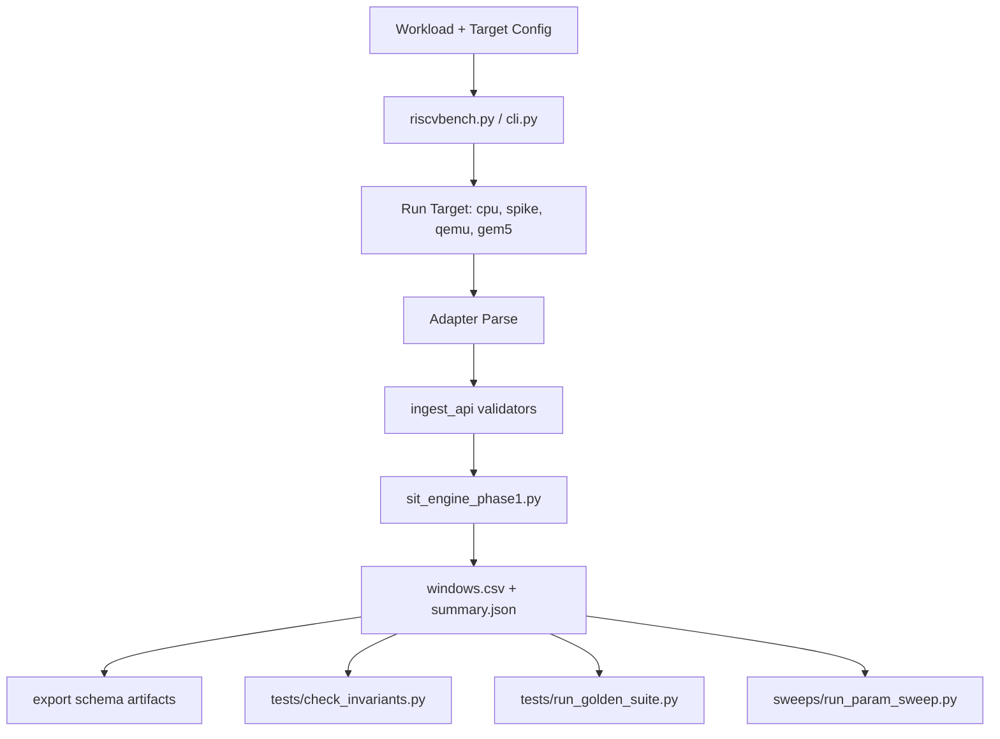

# RISCVBench Phase-2

If you are new and want to understand or extend Phase-2, use this reading order:

1. `Phase-2/README.md` (this file): architecture, workflow, toolchain assumptions
2. `Phase-2/ADAPTERS.md`: strict adapter contract and no-leakage boundary
3. `Phase-2/DATASETS.md`: governance, versioning, and replay gates for dataset changes
4. `Phase-2/VALIDATION.md`: contributor-facing validation and debugging guide
5. `Phase-2/docs/README.md`: deliverable-by-deliverable documentation map
6. `Phase-2/docs/platforms/KEY_REFERENCES_AND_ALL_CHECKS.md`: single key-reference + run-all-checks entrypoint
7. `Phase-2/docs/platforms/{spike,qemu,gem5}/README.md`: platform runbooks + validation commands

## Deliverable status (checked on 2026-03-05)

| Deliverable | Status | Evidence |
|---|---|---|
| Phase-2 README | Done | Scope + workflow are documented in this file and indexed from `Phase-2/docs/README.md`. |
| Spike simulator adapter | Done | `Phase-2/adapters/spike_adapter.py`; fixture guard in `Phase-2/tests/check_adapter_fixtures.py`. |
| Adapter contract | Done | `Phase-2/ADAPTERS.md` defines boundaries and no-leakage rules. |
| Golden micro-kernel traces | Done | Versioned baseline traces in `Phase-2/datasets/traces/` and pinned sweep bundles in `Phase-2/sweeps/pinned/`. |
| Golden output artifacts | Done | Golden replay scripts in `Phase-2/tests/run_golden_suite.py`, `Phase-2/tests/run_spike_golden_pipeline.py`, `Phase-2/tests/run_qemu_golden_pipeline.py`, `Phase-2/tests/run_gem5_golden_pipeline.py`. |
| Invariant validation suite | Done | Invariants and checks in `Phase-2/tests/check_invariants.py`, `Phase-2/tests/check_flag_monotonicity.py`, `Phase-2/tests/check_no_work_sit_modes.py`. |
| Parameter sweep runner | Done | Sweep matrix engine in `Phase-2/sweeps/run_param_sweep.py`; platform wrappers in `Phase-2/tools/run_{spike,qemu,gem5}_property_suite.sh`. |
| Dataset governance | Done | Policy and gates in `Phase-2/DATASETS.md`; dataset manifest in `Phase-2/datasets/manifest.json`. |
| CI integration | Done | Phase-2 workflow gate in `.github/workflows/phase2-ci.yml`. |
| Phase-2 validation guide | Done | `Phase-2/VALIDATION.md` plus platform run-all-checks entrypoint in `Phase-2/docs/platforms/KEY_REFERENCES_AND_ALL_CHECKS.md`. |

## Deliverable: Phase-2 README (Scope Definition)

### Technical Description
Phase-2 is the execution and validation layer that scales the SIT pipeline across multiple execution targets (CPU raw traces, Spike traces, gem5 traces) while preserving a single normalized ingest contract. Its purpose is to keep SIT math target-agnostic and move source-specific logic into adapters.

This document defines the scope, interfaces, and operational workflow for Phase-2 testing (including sweeps and new adapter addition).

### Implementation Fulfillment
This deliverable is fulfilled by the following Phase-2 code paths:

- CLI pipeline orchestration: `Phase-2/cli.py`
- Core SIT engine used by pipeline: `Phase-2/sit_engine_phase1.py`
- Adapter layer: `Phase-2/adapters/`
- Ingest contract + validators: `Phase-2/ingest/ingest_api.py`
- Cross-target replay/smoke validation: `Phase-2/run_cross_target_suite.py`
- Golden/invariant validation scripts: `Phase-2/tests/run_golden_suite.py`, `Phase-2/tests/check_invariants.py`
- Parameter sweep runner: `Phase-2/sweeps/run_param_sweep.py`
- Package/entrypoint (`riscvbench`): `Phase-2/pyproject.toml`, `Phase-2/riscvbench.py`

Done-when criteria mapping for this README deliverable:
- Scope doc exists in `Phase-2/README.md` (this file).
- Cross-linked from Phase-1 README: `Phase-1/README.md`.
- Review/approval status can be tracked in `Phase-1/docs/status/PHASE1_PHASE2_STATUS.md`.

### Design & Architecture
Key components:

- `riscvbench.py`: high-level runner for target/workload execution.
- Adapter modules: parse target-specific traces and emit normalized intervals.
- `ingest_api`: hard boundary contract (`start_us,end_us,core,state` and residency columns).
- SIT engine: computes window metrics and summaries from normalized inputs.
- Test/sweep harnesses: validate invariants and compare target behavior.

Data flow:
1. Target run produces trace(s).
2. Adapter normalizes to state/residency intervals.
3. Validators enforce ingest contract and interval semantics.
4. Engine computes windows + summaries.
5. CI/suites verify artifacts and invariants.

Dependencies:
- Python 3.9+ (`Phase-2/pyproject.toml`)
- pandas/numpy for parsing + validation paths
- external simulators/tools for target runs (Spike/gem5/CPU toolchain)

### Using `riscvbench` Inside a Virtualenv

Create and use a Phase-2 virtual environment:

```bash
cd Phase-2
python3 -m venv .venv-phase2
source .venv-phase2/bin/activate
python -m pip install --upgrade pip
python -m pip install -e .
riscvbench --help
```

Example (`riscvbench` from the active venv):

```bash
cd Phase-2
source .venv-phase2/bin/activate
riscvbench --target qemu --workload fm_mm --workload_size test --time_us 256 --expected-work-rate 1.0 --allow-nonzero-exit
```

### Platform Factor Taxonomy (SIT Interpretation)

Use these explicit factor buckets when describing what influences SIT:

- Workload/orchestration factors
- Runtime/OS factors
- Microarchitectural timing factors
- Measurement overhead

Platform-specific interpretation:

- Spike:
  - Functional ISA execution
  - Not modeled (no microarchitectural timing)
  - Instruction-stream structure (workload-driven)
  - Marker-defined residency intervals
- QEMU:
  - Host-accelerated functional emulation
  - Approximate timing (non-cycle-accurate)
  - Workload-driven orchestration gaps only for synthetic flag/residency variants
  - Runtime/OS factors are platform-dependent contributors
- gem5:
  - Microarchitectural timing factors (cycle-modeled), including cache hierarchy latency / miss penalties, branch misprediction penalties, pipeline stalls / contention, and memory system pressure (DRAM / NoC modeled)
- Hardware:
  - Real system execution effects, including real cache / memory contention, real branch predictor behavior, OS scheduling jitter (if applicable), and instrumentation overhead

Methodological note: Spike and QEMU do not model microarchitectural timing; gem5 and hardware platforms may.

### Flowchart


### Optional gem5 setup and run

Phase-2 already includes gem5 integration in:
- `Phase-2/riscvbench.py` (`--target gem5`)
- `Phase-2/adapters/gem5_adapter.py` (Exec trace -> normalized intervals)

Install/build gem5 (RISCV):

```bash
sudo apt-get update
sudo apt-get install -y git scons m4 python3-dev pkg-config zlib1g-dev \
  libprotobuf-dev protobuf-compiler libgoogle-perftools-dev libboost-all-dev

git clone https://github.com/gem5/gem5.git ~/opt/gem5
cd ~/opt/gem5
scons build/RISCV/gem5.opt -j"$(nproc)"
```

Set environment (or pass equivalent CLI args):

```bash
export GEM5_BIN=~/opt/gem5/build/RISCV/gem5.opt
export GEM5_ROOT=~/opt/gem5
export GEM5_CC=riscv64-linux-gnu-gcc
```

Run through Phase-2 pipeline:

```bash
cd Phase-2
python3 riscvbench.py \
  --target gem5 \
  --workload fm_mm \
  --workload_size small \
  --time_us 256 \
  --expected-work-rate 1.0
```

### Optional QEMU setup and run

Phase-2 includes QEMU integration in:
- `Phase-2/riscvbench.py` (`--target qemu`)
- `Phase-2/adapters/qemu_adapter.py` (QEMU dynamic `Trace ...` execution events + TB disassembly context -> normalized intervals)

Install user-mode QEMU and RISC-V cross-compiler:

```bash
sudo apt-get update
sudo apt-get install -y qemu-user gcc-riscv64-linux-gnu
```

Run through Phase-2 pipeline:

```bash
cd Phase-2
python3 riscvbench.py \
  --target qemu \
  --workload fm_mm \
  --workload_size small \
  --time_us 256 \
  --expected-work-rate 1.0 \
  --allow-nonzero-exit
```

Notes:
- QEMU runs are fatal on non-zero exit by default.
- Use `--allow-nonzero-exit` only when the workload intentionally returns a non-zero code but still emits a valid trace.
- Adapter heuristics (idle/stall inference) are parser-level normalization rules; SIT windowing/scoring policy remains in `sit_engine_phase1.py`.

Run QEMU golden matrix pipeline (same output structure as Spike pipeline):

```bash
cd Phase-2
python3 tests/run_qemu_golden_pipeline.py \
  --workloads fm_loopback fm_mm \
  --all-sizes \
  --emulated-flags none branch_mispredict cache_pressure both \
  --time-us 256 \
  --window-us 256 \
  --common-mode base \
  --outdir golden_out_qemu_matrix
```

### Spike Golden Matrix (All Sizes + Emulated Flags + Common Graphs)

Use the Spike golden pipeline to run a full size/flag matrix and generate one combined visualization across sizes.

```bash
cd Phase-2
python3 tests/run_spike_golden_pipeline.py \
  --pk /home/dev_srinidhi/riscv-isa-sim/riscv-pk/build/pk \
  --workloads fm_loopback \
  --all-sizes \
  --emulated-flags none branch_mispredict cache_pressure both \
  --time-us 256 \
  --window-us 256 \
  --common-mode base \
  --outdir golden_out_spike_matrix
```

Main outputs:

- `golden_out_spike_matrix/trace_index.csv` (workload, size, flag metadata per trace)
- `golden_out_spike_matrix/plots/invariant_report.csv`
- `golden_out_spike_matrix/plots/invariant_report_enriched.csv`
- `golden_out_spike_matrix/plots/common_sit_median_base.svg`
- `golden_out_spike_matrix/plots/common_invariant_pass_rate_base.svg`
- `golden_out_spike_matrix/plots/common_summary_base.csv`
- `golden_out_spike_matrix/plots/common_summary_by_workload_base.csv`
- `golden_out_spike_matrix/plots/common_sit_median_base__<workload>.svg`
- `golden_out_spike_matrix/plots/common_invariant_pass_rate_base__<workload>.svg`
- `golden_out_spike_matrix/plots/common_sit_median_by_workload_base.svg`
- `golden_out_spike_matrix/plots/common_invariant_pass_rate_by_workload_base.svg`

Notes:

- `--all-sizes` expands to `test,tiny,small,med,large`.
- `--emulated-flags` controls synthetic perturbation variants for workload/orchestration factors.
- For Spike/QEMU, `branch_mispredict` and `cache_pressure` variants are interpreted as workload/orchestration factors (not microarchitectural timing).
- On gem5/hardware targets, those variants may also surface microarchitectural timing factors when timing is modeled.
- Monotonic flag checks run by default in matrix pipelines (baseline vs flag variants on `base` summaries). Use `--skip-monotonic-check` to disable.
- `--common-mode` selects which residency mask mode is used for the combined graphs (`base`, `all`, `skip_w0`, `partial`, `exact_boundary`).
- The runner executes combinations one-by-one and prints explicit per-case progress (`case i/N`).
- `window_active` is the default no-`work_done` SIT fallback mode across `riscvbench`, `cli classify`, and `sit_engine_phase1`.
