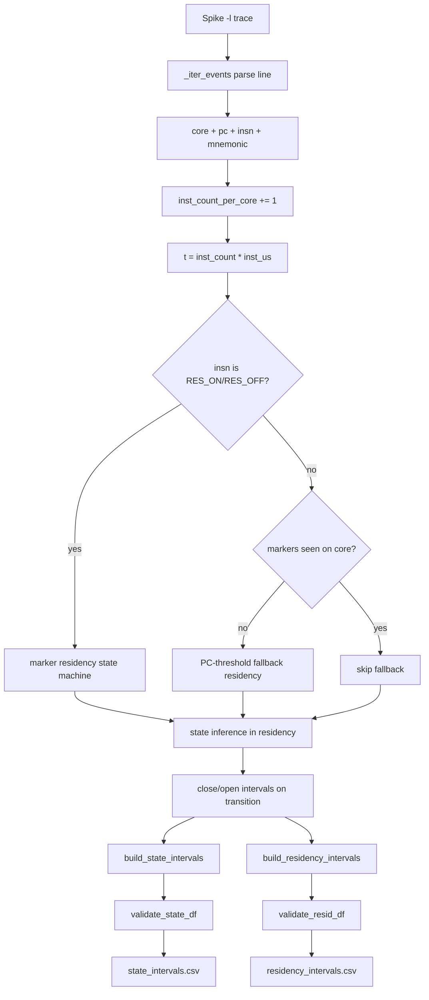

# Spike Simulator Adapter (Phase-2 Deliverable)

## Technical Description
The Spike simulator adapter normalizes `spike -l` commit traces into the Phase-2 ingest contract so that SIT windowing logic remains simulator-agnostic.

Purpose:
- convert instruction-level Spike text logs into interval-level state and residency data,
- preserve per-core timing semantics,
- emit deterministic artifacts for downstream SIT computation and validation.

Role in architecture:
- this adapter is the Spike-specific translation boundary between raw simulator output and normalized engine input.
- engine logic never parses Spike format directly.

Primary outputs:
- `state_intervals.csv`: `start_us,end_us,core,state`
- `residency_intervals.csv`: `start_us,end_us,core,resident`

## Implementation Fulfillment
Code fulfillment is implemented in:
- `Phase-2/adapters/spike_adapter.py`

Key implementation points:
- Parsing and event extraction:
  - `SPIKE_LINE_RE`, `CORE_FALLBACK_RE`, `PC_AFTER_CORE_RE`, `GENERIC_CORE_RE`
  - `_iter_events()` emits `(core, mnemonic, inst_count, raw_mnemonic, pc, insn_val)`.
- Time normalization:
  - `SpikeParseConfig.inst_us` and `t = inst_count * inst_us`.
- Residency detection:
  - marker opcodes: `RES_ON_INSN = 0x06500013`, `RES_OFF_INSN = 0x06600013`,
  - fallback: `pc >= resident_pc_ge` when markers are absent for that core.
- State inference:
  - `_collect_core_timeline()` classifies `idle/stall/active` inside residency.
- Output materialization:
  - `build_state_intervals()`, `build_residency_intervals()`, `export_baseline_csvs()`.
- Contract enforcement:
  - `validate_state_df` / `validate_resid_df` from `Phase-2/ingest/ingest_api.py`.

Done-when criteria mapping ("golden kernels reproduce expected SIT behavior"):
- workload generation and marker insertion path: `Phase-2/riscvbench.py`,
- replay/smoke artifacts across targets: `Phase-2/run_cross_target_suite.py`,
- deterministic engine replay checks: `Phase-2/tests/run_golden_suite.py`.

## Design & Architecture
Components:
- Trace parser: converts variable-format Spike lines into structured events.
- Timeline builder: tracks per-core instruction index and residency mode.
- State classifier: infers `idle/stall/active` only in residency windows.
- Interval builder: emits contiguous, validated interval tables.

Interfaces:
- Input: Spike text trace (`--spike-trace`).
- Output: normalized CSVs for the ingest contract.

Data flow:
1. Parse line -> core/pc/insn/mnemonic.
2. Increment per-core instruction count.
3. Map instruction index to microsecond timestamp.
4. Determine residency (marker-first, PC-threshold fallback).
5. Infer state while resident.
6. Close/open intervals on transitions and EOF.
7. Validate and write CSV artifacts.

Dependencies:
- `pandas` for DataFrame construction,
- `ingest_api` validators for schema and interval sanity.

Equations:
\[
t_{c,k} = k \cdot \Delta t_{inst}
\]
\[
resident(t)=
\begin{cases}
1, & \text{marker-open}\\
1, & pc(t)\ge pc_{th}\ \text{(fallback)}\\
0, & \text{otherwise}
\end{cases}
\]
\[
state(t)=
\begin{cases}
idle, & \text{idle-rule match}\\
stall, & \text{stall-rule match}\\
active, & \text{otherwise}
\end{cases}
\]

## Flowchart


## CLI
```bash
python Phase-2/adapters/spike_adapter.py \
  --spike-trace <path/to/spike.trace> \
  --out-dir <run/inputs> \
  --inst-us 1.0 \
  --resident-pc-ge 0x80000000
```
