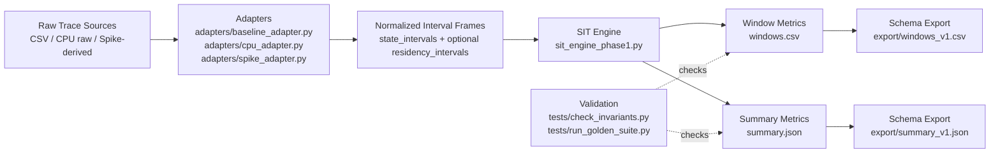
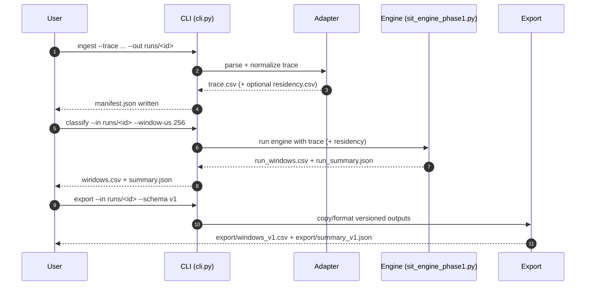
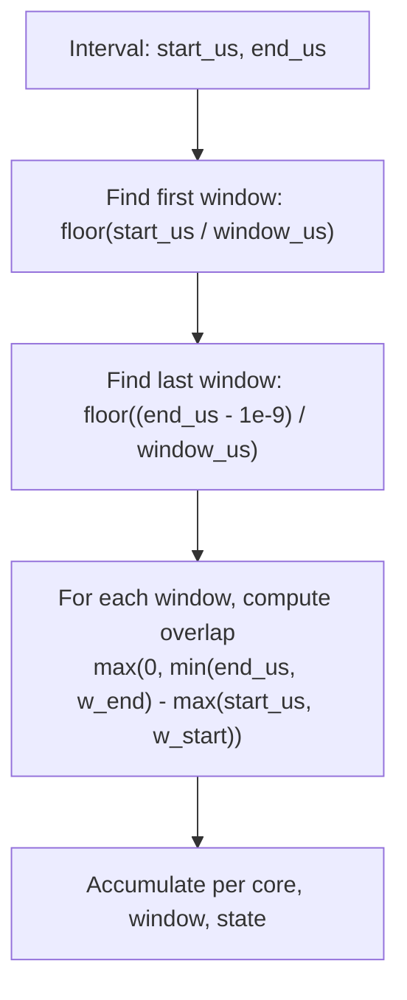

# RISCBench Phase-1 SIT Engine

A practical Phase-1 implementation of a **Sustained Instantaneous Throughput (SIT)** pipeline for trace-based performance analysis.

This repository provides:
- A normalized ingestion contract (`ingest/ingest_api.py`)
- Adapter-based trace loading (`adapters/`)
- Windowed SIT computation with optional residency gating (`sit_engine_phase1.py`)
- A staged CLI workflow (`cli.py`: `ingest` → `classify` → `export`)
- Schema-validated outputs (`schema/v1.py`)
- Golden/invariant validation scripts (`tests/`)

---

## Phase-1 / Phase-2 deliverables dashboard

A consolidated progress page is available in:

- [`PHASE1_PHASE2_STATUS.md`](PHASE1_PHASE2_STATUS.md)

This keeps the deliverables list in checklist order and tracks:
- what was requested,
- what is currently implemented,
- assumptions/design notes,
- run commands per section,
- completion percentages.

---

## Technical report (separate PDF section)

The technical report is maintained separately from this README:

- Source: [`docs/phase1_technical_document.tex`](docs/phase1_technical_document.tex)
- Generalization notes: [`GENERALIZATION.md`](GENERALIZATION.md)

If you want a PDF locally, compile the TeX source:

```bash
cd docs
pdflatex phase1_technical_document.tex
```

Generated output (typical): `docs/phase1_technical_document.pdf`

### Local Python setup (venv-first)

Use a virtual environment for all local runs:

```bash
python -m venv .venv
source .venv/bin/activate
python -m pip install --upgrade pip
python -m pip install -e . --no-build-isolation
```

Then run pipeline/smoke commands from the same activated venv.

---

## 1) Why this exists

Phase-1 is designed to be:
- **Hardware-agnostic**: the engine consumes normalized intervals, not target-specific trace formats.
- **Deterministic**: fixed window slicing and explicit boundary behavior.
- **Extensible**: new adapters can be added without changing core SIT math.
- **Testable**: dataset manifest + golden outputs + invariant checks.

---

## 2) High-level architecture



### Design considerations

1. **Strict adapter boundary**  
   Engine logic only sees normalized columns (start/end/core/state/work), minimizing coupling to source formats.

2. **Half-open interval semantics** (`[start_us, end_us)`)  
   Prevents double counting and allows exact-boundary correctness across windows.

3. **Residency-aware accounting**  
   If residency exists, all state accumulation is clipped to residency masks.

4. **Stable schema contract**  
   Export step materializes versioned artifacts (`*_v1`) for downstream compatibility.

5. **Two operational modes for SIT**  
   - With `work_done`: normalized by `expected_work_rate`
   - Without `work_done`: falls back to active fraction

---

## 3) End-to-end workflow (operator view)



### Minimal commands

```bash
python cli.py ingest --trace datasets/traces/trace_A_single_residency.csv --out runs/A
python cli.py classify --in runs/A --window-us 256 --residency datasets/residency/partial.csv
python cli.py export --in runs/A --schema v1
```

---

## 4) Technical specification

### 4.1 Core inputs

#### State intervals (normalized)
Required fields (via ingest API / adapters):
- `start_us` (float)
- `end_us` (float)
- `core` (int)
- `state` in `{active, stall, idle}`
- optional `work_done` (float)

#### Residency intervals (optional)
- `start_us`, `end_us`, `core`
- residency windows are merged per core before gating

---

### 4.2 Windowing and overlap behavior

The engine slices intervals into fixed windows of `window_us` using half-open intervals.



**Boundary rule:** subtracting epsilon (`1e-9`) for last-window selection prevents an interval ending exactly on a boundary from spilling into the next window.

---

### 4.3 Residency gating logic

If residency is provided:
- Build merged residency mask per core
- Intersect each state interval with the mask
- Only intersected pieces contribute to `active_us`, `stall_us`, `idle_us`
- `resident_us` is independently accumulated from residency mask overlap

If residency is not provided:
- Each window is treated as fully resident (`resident_us = window_us`)

---

### 4.4 Per-window metrics

For each `(core, window_id)`:
- `resident_us`
- `resident_frac_of_window = resident_us / window_us`
- `is_resident_window = 1 if resident_us > 0 else 0`
- `active_frac`, `stall_frac`, `idle_frac` (NaN for non-resident windows)
- `sit`

When `resident_us > 0`:
1. Accumulate state durations within residency
2. Gap-fill to residency (`idle += resident_us - (active+stall+idle)` if needed)
3. Convert to fractions over total resident-accounted time
4. Compute SIT:
   - with `work_done`: `sit_raw = (work_done / resident_us) / expected_work_rate`
   - otherwise: `sit_raw = active_frac`
5. Clamp: `sit = min(max(sit_raw, 0), 1)`

---

### 4.5 Summary metrics (`summary.json`)

Computed on resident windows only:
- `schema_version`
- `window_us`
- `windows_total`
- `resident_windows_total`
- `cores`
- `sit_median`
- `sit_p95`
- `residency_idle_avg`
- `residency_stall_avg`
- `residency_active_avg`
- `used_residency_file`
- `expected_work_rate`

---

### 4.6 Data products and layout

```text
runs/<run_id>/
  manifest.json
  trace.csv
  residency.csv                # optional
  windows.csv
  summary.json
  export/
    windows_v1.csv
    summary_v1.json
```

---

## 5) Module responsibilities

- `ingest/ingest_api.py`: normalized schema, validators, adapter contract
- `adapters/baseline_adapter.py`: CSV reference adapter (+ raw path handling)
- `adapters/cpu_adapter.py`: CPU raw trace parsing support
- `adapters/spike_adapter.py`: Spike-specific support
- `sit_engine_phase1.py`: window splitting, residency gating, SIT/summary generation
- `cli.py`: user-facing pipeline orchestration
- `schema/v1.py`: output schema validation for export contract
- `tests/check_invariants.py`: semantic invariants on produced windows
- `tests/run_golden_suite.py`: reproducible suite execution over manifest datasets

---

## 6) Validation workflow

```bash
# Single-output invariant check
python tests/check_invariants.py --windows out/A_partial_windows.csv --mode partial --window-us 256

# Full golden suite
python tests/run_golden_suite.py --outdir golden_out
```

Recommended CI order:
1. Ingest/classify/export smoke run
2. Invariant checks on generated windows
3. Golden suite against pinned datasets

---

## 7) RISC-V bench integration notes

`riscvbench.py` can generate traces for Spike and CPU targets and feed the same Phase-1 pipeline.

Typical example:

```bash
python riscvbench.py \
  --target spike \
  --workload matmul \
  --workload_size small \
  --time_us 256 \
  --pk /path/to/riscv-pk/build/pk
```

Useful flags:
- `--events-max`: cap parsed events
- `--cores` (alias for `--compute-threads`): relevant for multicore workloads
- `--debug-sit`: print SIT internals (`raw`, `clamped`, idle/stall totals)

---

## 8) Extension guide

### Add a new adapter
1. Implement ingest contract in `ingest/ingest_api.py` terms
2. Emit normalized state intervals (+ optional residency intervals)
3. Keep engine untouched
4. Add dataset + golden expectations

### Add a new schema version
1. Create `schema/v2.py`
2. Update export subcommand choices
3. Keep `v1` backward-compatible

---

## 9) Troubleshooting

- **`trace not found`**: ensure absolute/relative path is correct for `--trace`.
- **No residency effect**: verify residency file is passed or present in `manifest.json`.
- **SIT always near 1.0**: lower expected work rate tolerance / enable queue-pressure options / inspect `--debug-sit` output.
- **Unexpected window counts**: verify `window_us` and half-open interval assumptions.

---

## 10) Quick reference

```bash
# Direct engine run (no CLI wrapper)
python sit_engine_phase1.py --trace datasets/traces/trace_A_single_residency.csv --window-us 256 --out-prefix out/A_base

# Direct engine run with residency
python sit_engine_phase1.py --trace datasets/traces/trace_A_single_residency.csv --residency datasets/residency/partial.csv --window-us 256 --out-prefix out/A_partial
```

If you are new to the repo, start with:
1. `cli.py ingest`
2. `cli.py classify`
3. `cli.py export`
4. `tests/check_invariants.py`

This path gives the fastest understanding of contracts, artifacts, and correctness checks.
