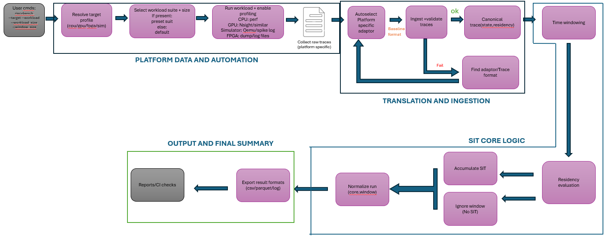

# SIT CPU Baseline

This repository is organized around the project phases, with only shared documentation kept at the root level.

## Phases

- [Phase-0](Phase-0/README.md) - Tenstorrent Prototype-Tenstorrent programs
- [Phase-1](Phase-1/README.md) - hardware-agnostic SIT engine and parity validation
- [Phase-2](Phase-2/README.md) - platform adapters, target runners, and platform documentation
- [Phase-3](Phase-3/README.md) - reserved for the next phase

## Shared Docs

- [docs/README.md](docs/README.md)

## SIT Engine Design Diagram

