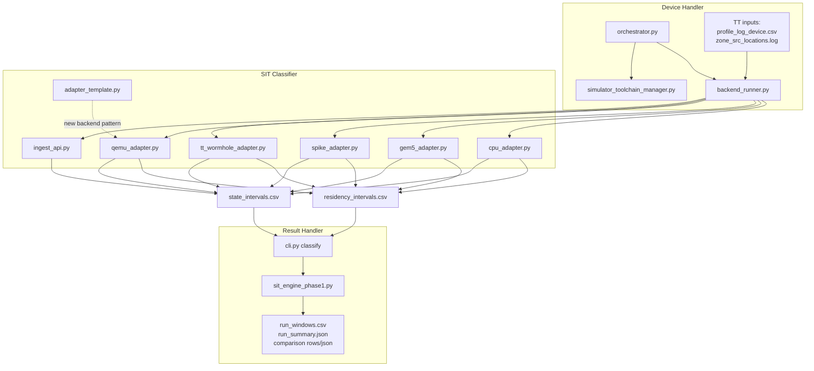

# Workflow Architecture

This bundle is organized around three execution layers:

1. `device_handler/`
2. `sit_classifier/`
3. `result_handler/`

Runtime Python implementation and public entrypoints now live directly under those three folders.

## Folder Map

```text
riscbench tenstorrent/
├── device_handler/
│   ├── orchestrator.py
│   ├── backend_runner.py
│   ├── simulator_toolchain_manager.py
│   └── README.md
├── sit_classifier/
│   ├── ingest_api.py
│   ├── adapters/
│   │   ├── adapter_template.py
│   │   ├── tt_wormhole_adapter.py
│   │   ├── qemu_adapter.py
│   │   ├── spike_adapter.py
│   │   ├── gem5_adapter.py
│   │   └── cpu_adapter.py
│   └── README.md
├── result_handler/
│   ├── cli.py
│   ├── sit_engine_phase1.py
│   └── README.md
├── configs/
├── datasets/
├── dependencies/
├── results/
└── run.sh
```

## End-To-End Flow



## Workflow Modes

### Tenstorrent Reference + Comparison Simulators

Use this when TT hardware output drives the comparison:

1. `device_handler/orchestrator.py` resolves TT input files.
2. `device_handler/backend_runner.py` runs the TT ingest path.
3. `sit_classifier/adapters/tt_wormhole_adapter.py` emits normalized state and residency CSVs.
4. `result_handler/cli.py` and `result_handler/sit_engine_phase1.py` compute TT SIT.
5. The orchestrator fans out `qemu`, `spike`, and/or `gem5`.
6. Only these TT comparison backends inherit TT-derived calibration inside the orchestrator.

### Simulator-Only Suite

Use this when there is no TT hardware reference:

1. `device_handler/orchestrator.py` selects one simulator or a simulator suite.
2. `device_handler/simulator_toolchain_manager.py` resolves installed tool paths.
3. Backend-specific adapters emit normalized interval CSVs.
4. `result_handler/` computes SIT per backend.
5. No TT-reference calibration is inherited.

## Command Entry Points

- Public orchestration entrypoint: `device_handler/orchestrator.py`
- Public single-backend entrypoint: `device_handler/backend_runner.py`
- Public result CLI entrypoint: `result_handler/cli.py`

These wrappers delegate to:
- `device_handler/orchestrator.py`
- `device_handler/backend_runner.py`
- `result_handler/cli.py`

## Tenstorrent Input Contract

For a real TT hardware run, the orchestrator consumes:

- `tt_profile_csv`
- `tt_zone_log`

Those usually point to:

- `.../profiler_logs/profile_log_device.csv`
- `.../profiler_logs/zone_src_locations.log`

If you use the bundled datasets, the orchestrator can autofill those paths from `workload` plus `workload_size`.
